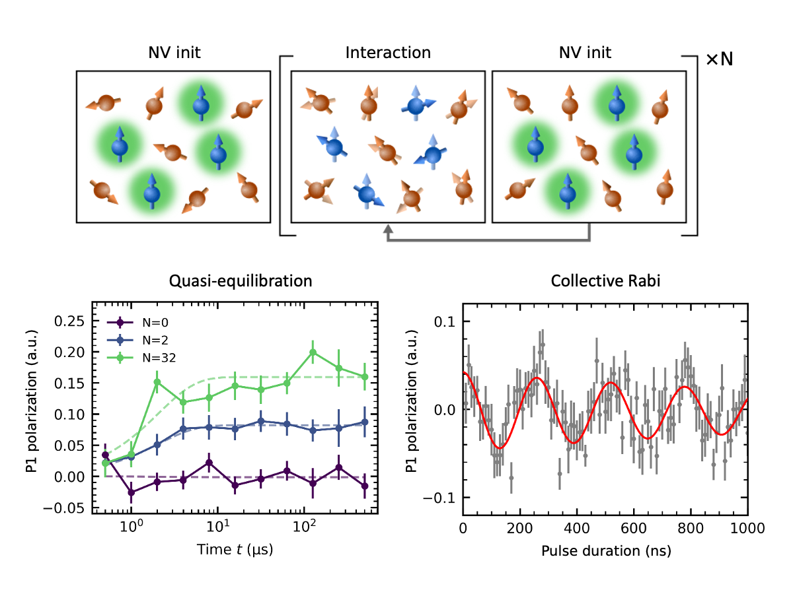
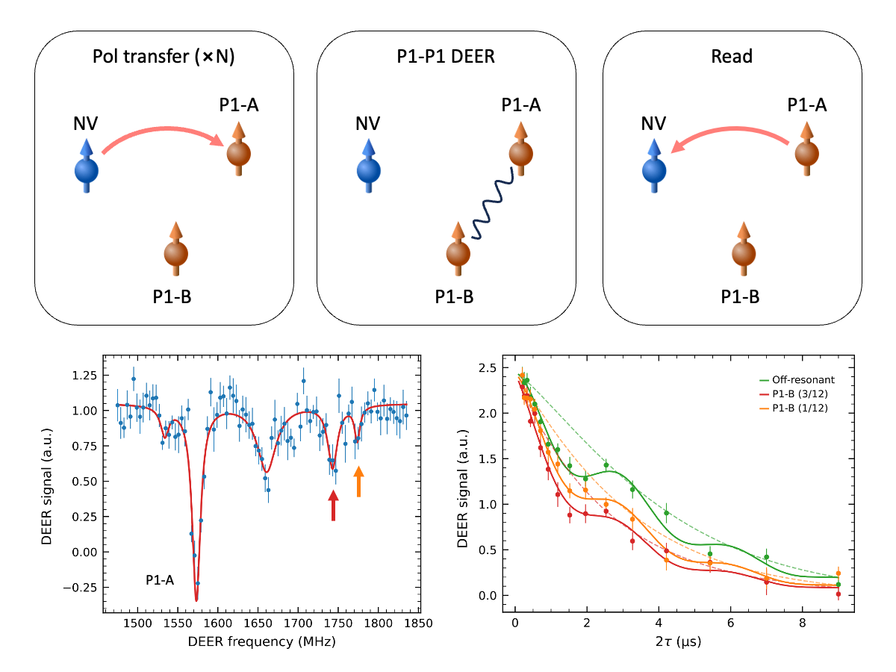
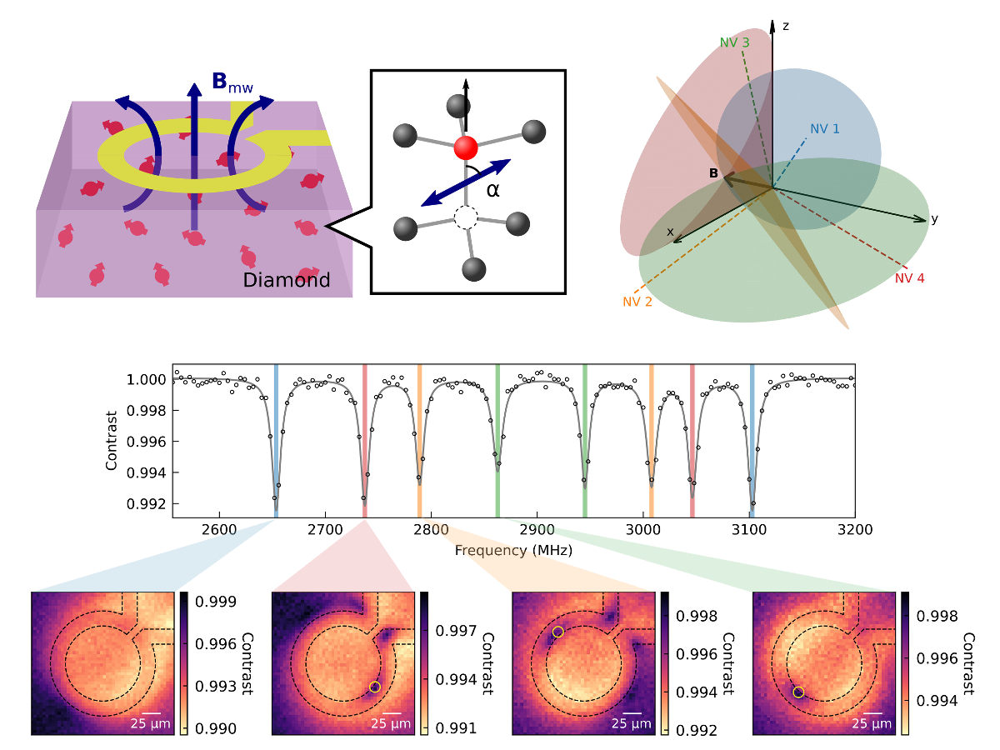
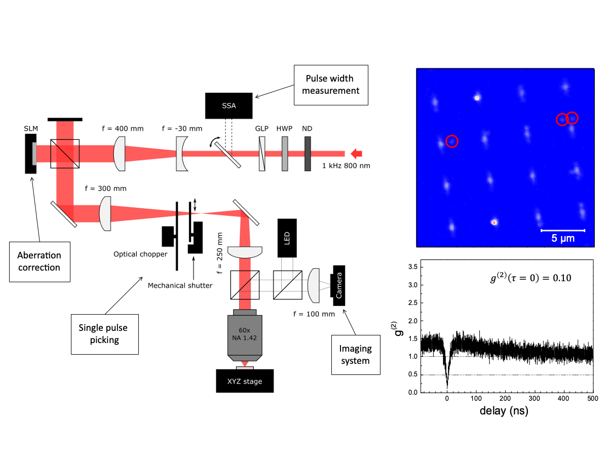

---
#
# By default, content added below the "---" mark will appear in the home page
# between the top bar and the list of recent posts.
# To change the home page layout, edit the _layouts/home.html file.
# See: https://jekyllrb.com/docs/themes/#overriding-theme-defaults
#
layout: home
title: About
---

    

        
    

    

        

            I am Taewoong Yoon, a Ph.D. candidate advised by <strong><a href="https://choigroup.snu.ac.kr" target="_blank">Prof. Hyunyong Choi</a></strong>
            in the Department of Physics and Astronomy at <strong>Seoul National University</strong>.
            I also work with <strong><a href="https://sites.google.com/view/pauleegroup" target="_blank">Dr. Junghyun Lee</a></strong>
            at the <strong>Korea Institute of Science and Technology (KIST)</strong>. I expect to complete my Ph.D. in February 2027 and am seeking a postdoctoral position.
        

        

            My research focuses on coherent control of <strong>electron spin defects in diamond</strong>, in particular
            nitrogen-vacancy (NV) and substitutional nitrogen (P1) centers, and on the interactions and
            polarization dynamics among these spin ensembles.
            I also <strong>built the group's first NV measurement setup</strong>, from the confocal optics and
            microwave hardware to pulse control and data acquisition software.
        

    

<section class="research-section">
    <h2>Research</h2>

    

        

            
        

        

            <h3>Mesoscopic spin coherence in a disordered dark electron spin ensemble</h3>
            

                P1 centers are optically dark and cannot be initialized with light. By iteratively
                transferring polarization from optically initialized NV centers, I polarized the P1
                ensemble and characterized its collective coherent dynamics.
            

            

                <a href="https://doi.org/10.48550/arXiv.2602.17074" target="_blank">arXiv:2602.17074</a> (2026)
            

        

    

    

        

            
        

        

            <h3>Polarization transfer between P1 subgroups</h3>
            

                I extended the protocols established between NV and P1 centers to P1&ndash;P1, probing the interactions between hyperfine-resolved P1 subgroups and
                demonstrating polarization transfer between them.
            

        

    

    

        

            
        

        

            <h3>Vector magnetometry with NV ensembles</h3>
            

                NV centers in an ensemble are oriented along four crystallographic axes, and
                reconstructing a vector magnetic field requires assigning each resonance to its axis.
                I developed a method that identifies the axes from a spatially varying microwave field,
                enabling vector magnetometry without a calibrated bias field.
            

            

                <a href="https://doi.org/10.1063/5.0243162" target="_blank"><em>Applied Physics Letters</em> <strong>126</strong>, 144002 (2025)</a>
            

        

    

    

        

            
        

        

            <h3>Femtosecond laser writing of color centers</h3>
            

                I built a single-pulse femtosecond laser-writing system with aberration correction
                for site-controlled creation of color centers in diamond and hexagonal boron nitride,
                and confirmed single emitters by photon antibunching.
            

        

    

</section>
